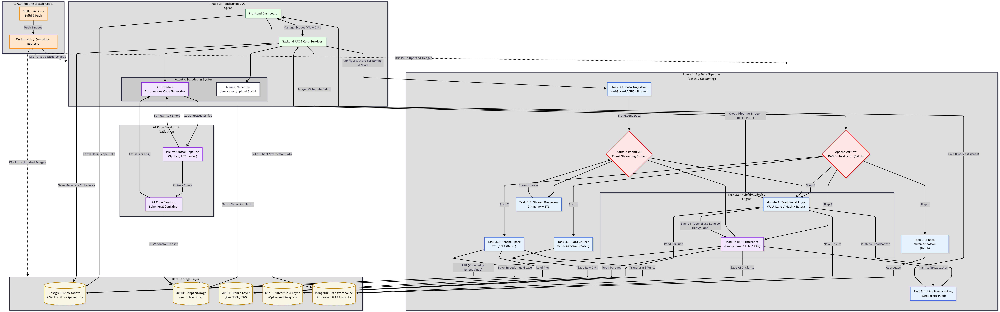

# Agentic Platform for Search Analyze Data (Test version)

Here is a revised and expanded **"About the project"** section for your `README.md`. This version highlights the platform's versatility, showing that its hybrid architecture (Batch + Streaming + AI Sandbox) can handle a wide spectrum of use cases beyond just financial data.

***

## About the Project

**Agentic Platform for Search and Analyze Data** is a highly scalable, hybrid data orchestration platform designed to seamlessly integrate data ingestion, distributed processing, traditional algorithmic logic, and AI-driven inference. 

By bridging the gap between scheduled batch processing (via Apache Airflow and Spark) and low-latency event-driven streaming (via RabbitMQ), this platform empowers users and Autonomous AI Agents to build complex, cross-triggered workflows. The system collects, cleans, and analyzes disparate data sources to generate actionable intelligence, predictive insights, and real-time visualizations.

While initially conceptualized for financial analysis, the platform's modular tool-calling architecture makes it highly adaptable to virtually any data-heavy domain. 

### Core Capabilities & Potential Use Cases:

* **📈 Quantitative Finance & Market Intelligence (Original Scope):**
    * Continuously monitor stock/crypto prices via WebSockets to detect anomalies using traditional technical indicators (RSI, MACD).
    * Automatically trigger LLMs to scrape and read the latest financial news or quarterly reports (via RAG) to assess market sentiment when a price breakout occurs.
* **🛒 E-Commerce & Market Research:**
    * Scrape competitor pricing and product availability on a scheduled batch pipeline.
    * Stream real-time customer reviews from social platforms and use AI to perform sentiment analysis, instantly alerting the marketing team to emerging PR crises or viral trends.
* **🛡️ Cybersecurity & IT Operations:**
    * Ingest server logs and network traffic in real-time.
    * Use fast-lane traditional logic to detect DDoS signatures, while utilizing AI classification models in the background to identify sophisticated zero-day anomalies or parse threat intelligence feeds.
* **🏭 IoT & Predictive Maintenance:**
    * Stream sensor data (temperature, vibration) from manufacturing equipment.
    * Apply time-series forecasting models to predict machinery failure before it happens, automatically scheduling maintenance tasks via cross-pipeline API triggers.
* **📱 Social Media & Trend Discovery:**
    * Aggregate vast amounts of unstructured data from forums, Reddit, or Twitter.
    * Utilize Spark for heavy text ETL, embed the data into the Vector Database, and deploy an AI Agent to summarize daily trending topics or consumer behavior shifts into a visual dashboard.

**The ultimate goal of this platform is to act as a unified "brain" where deterministic logic and generative AI work together autonomously to turn raw data into strategic decisions.**

## Phase 1: Build Data Pipeline & Infrastructure (Flexible & Scalable)

### 1. Data Lake, Data Warehouse & Storage (Write `docker-compose.yml` )
- MinIO (S3-compatible) - *Data Lake & Script Storage*[cite: 2]
    
     Collect all raw data (JSON, CSV from API).[cite: 2]
    
    **1. Bucket: `ai-tool-scripts`**[cite: 2]
    
    - **Responsibilities:** Store code files (Python, Go, Rust) created by AI or humans.[cite: 2]
    - **Internal Structure (Prefix/Folder):**
        - `/traditional-logic/` (Module A)[cite: 2]
        - `/ai-inference/` (Module B)[cite: 2]
        - `/sandbox-temp/` (For code to be tested)[cite: 2]
    
    **2. Bucket: `Raw Data` (also known as Bronze Layer)**[cite: 2]
    
    - **Responsibility:** Collect raw data that has just been retrieved from the API (JSON, CSV, HTML) without any modifications, so that we can always revert to the original data if ETL encounters any issues.[cite: 2]
    - **Internal Structure (Prefix/Folder):**
        - `/financial-statements/year=2024/quarter=1/`[cite: 2]
        - `/stock-prices/ticker=AAPL/`[cite: 2]
        - `/news/year=2024/month=10/`[cite: 2]
    
    **3. Bucket: `Processed Data` (also known as the Silver/Gold Layer)**[cite: 2]
    
    - **Responsibilities:** Collect data that has passed through Task ETL/ELT (Spark Processing) and is already cleaned, then convert it into fast-reading formats such as **Apache Parquet** or **Delta Lake**.[cite: 2]
    - **Internal Structure (Prefix/Folder):**
        - `/clean-financials/`[cite: 2]
        - `/aggregated-prices/`[cite: 2]
    
     Store Tool Scripts (Python, Go, Rust code written by AI or humans)[cite: 2]
    
- PostgreSQL - Metadata, State Management & Vector Store
   PostgreSQL serves as the "brain" for managing Users, Scopes, Tools, and the status of AI.[cite: 2]
    1. **Group: Vector Database
    Enable Extension:** Enable `pgvector` in PostgreSQL to store High-dimensional Vector data without adding new Database Components[cite: 2]
        
        • **`knowledge_embeddings`**: When Task 3.2 (ETL) is executed, Text data (such as economic news, meeting reports) will be processed for Chunking and Embedding generation, stored here for AI Inference (Module B) to perform Retrieval-Augmented Generation (RAG) retrieves relevant context for sentiment analysis or event prediction with high accuracy.[cite: 2]
        - `id` (UUID, PK)[cite: 2]
        - `scope_id` (FK)[cite: 2]
        - `source_reference` (URL or Path of the news file/financial statement in MinIO)[cite: 2]
        - `chunk_text` (Text snippet that has been extracted)[cite: 2]
        - `embedding` (Vector data type `VECTOR(1536)` or according to the size of the Embedding Model)[cite: 2]
        - `created_at` (Timestamp)[cite: 2]
        
    2. **Group: User & Authentication**[cite: 2]
        
        • **`users`**: Store user information[cite: 2]
        - `id` (UUID, PK)[cite: 2]
        - `email`, `password_hash`, `full_name`[cite: 2]
        - `created_at`, `updated_at`[cite: 2]
        
    3. **Group: Scope & Project Management**[cite: 2]
        
        • **`scopes`**: Collect details of the scope of work created by the user[cite: 2]
        - `id` (UUID, PK)[cite: 2]
        - `user_id` (FK -> users.id)[cite: 2]
        - `name`, `description`, `goal`[cite: 2]
        - `schedule_mode` (Enum: `'MANUAL'`, `'AI_AGENT'` ) (Choose whether to create schedule manually or let AI create it)[cite: 2]
        - `status` (Enum: `'ACTIVE'`, `'PAUSED'` )[cite: 2]
        
    4. **Group: AI Models & Tool Metadata**[cite: 2]
        
        • **`ai_models`**: Model Metadata & Assets[cite: 2]
        Store only model data and the location of the Weights file.[cite: 2]
        - `id` (UUID, PK)[cite: 2]
        - `model_name` (e.g., `'Llama-3-8B-Instruct'`, `'LSTM-Stock-Predictor'` )[cite: 2]
        - `version` (e.g., `'v1.0'` )[cite: 2]
        - `framework` (e.g., `'PyTorch'`, `'ONNX'`, `'GGUF'` )[cite: 2]
        - `model_path` (URL pointing to a `.safetensors` or `.bin` file in MinIO)[cite: 2]
        - `model_type` (Enum: `'LLM'`, `'TIME_SERIES'`, `'CLASSIFICATION'`,`'EXTERNAL_API'` )[cite: 2]
        
        • **`tools`**: Execution Logic & Scripts[cite: 2]
        Store scripts used for operations, including scripts that perform Preprocess -> Load Model -> Postprocess[cite: 2]
        - `id` (UUID, PK)[cite: 2]
           `ai_model_id` (FK -> ai_models.id, Nullable) *— Insert this FK to indicate which model this script is written to load or manage (if it's a general script that doesn't use AI, set the value to NULL)*[cite: 2]
        - `name` (e.g., `'Llama-3 Inference Script'`, `'RSI Calculator'` )[cite: 2]
        - `language` (Enum: `'Python'`, `'Go'`, `'C++'` )[cite: 2]
        - `script_url` (URL pointing to a `.py` or `.go` script file in MinIO)[cite: 2]
        - `input_schema`, `output_schema` (JSON)[cite: 2]
        - `author_type` (Enum: `'HUMAN'`, `'AI_GENERATED'` )[cite: 2]
        
    5. **Group: Scheduling & Tasks**[cite: 2]
        
        • **`schedules`**: Defines the work schedule for each Scope[cite: 2]
        - `id` (UUID, PK)[cite: 2]
        - `scope_id` (FK)[cite: 2]
        - `task_mode` (Enum: `'MANUAL'`,  `'AI_AGENT'` ) (Choose whether to create the task manually or let AI create it)[cite: 2]
        - `execution_type`: (Enum: `'CRON'`, `'ONCE'`, `'CONTINUOUS'` ) `CONTINUOUS` is used for Streaming tasks that need to be left running continuously[cite: 2]
        - `restart_policy`: (Enum: `'ALWAYS'`, `'ON_FAILURE'`, `'NEVER'` ) For Streaming tasks, if the script crashes, should the system automatically restart? [ `CONTINUOUS` ][cite: 2]
        - `is_sequential` (Boolean: Run consecutively or separately by time)[cite: 2]
        - `cron_expression` (For setting independent schedules, specifying run schedule times)[cite: 2]
        
        • **`tasks`**: Execution Instances & Configs[cite: 2]
        Store instances of tasks to be executed by Airflow or RabbitMQ/Apache Kafka, along with special configurations for each run.[cite: 2]
        - `id` (UUID, PK)[cite: 2]
        - `schedule_id` (FK)[cite: 2]
        - `task_type` (Enum: `'SEARCH'`, `'ETL'`, **`'TRADITIONAL_LOGIC'`**, `'AI_INFERENCE'`, `'VISUALIZE'` )[cite: 2]
        - `tool_id` (FK -> tools.id)[cite: 2]
        - `engine_type`: (Enum: `'AIRFLOW_DAG'`, `'STREAMING_WORKER'` ) To specify where this Task will be executed.[cite: 2]
        - `depends_on_task_id` (Self-referencing FK for tasks that need to be performed sequentially, used to tell Airflow who needs to wait for whom (A $\rightarrow$ B $\rightarrow$ C) to create the correct Workflow) [ `AIRFLOW_DAG` ][cite: 2]
        - `priority` (used for queue jumping, competing for resources when work overloads the server of each Apache Spark scope) [ `AIRFLOW_DAG` ][cite: 2]
        - `execution_order` (used for displaying numbers in order for easy viewing on the UI (1, 2, 3...)) [ `AIRFLOW_DAG` ][cite: 2]
        - `broker_topic`: (String, Nullable) For Streaming tasks, specify the Topic name in the Message Broker (e.g., RabbitMQ) that this script needs to read or write data to [ `STREAMING_WORKER` ][cite: 2]
        - `arguments` (JSONB) *Store Configuration (see example below)*[cite: 2]
        
         Example of data collection in the `arguments` column (JSONB)[cite: 2]
           Using the `JSONB` data type in PostgreSQL allows you to freely store configurations that have different structures for each task:[cite: 2]
        
        **Case 1: Task runs LLM Model (AI Inference)**[cite: 2]
        The script in `tools` will pull the model path from `ai_models` and retrieve the generation configuration from `tasks.arguments`[cite: 2]
        
        `{
          "temperature": 0.7,
          "max_tokens": 1024,
          "top_p": 0.9,
          "system_prompt": "You are a financial analyst. Your task is to read news and assess sentiment..."
        }`
        
        **Case 2: Task calls an External API (such as OpenAI or a News API)**[cite: 2]
        
        `{
          "api_endpoint": "https://api.openai.com/v1/chat/completions",
          "api_key": "sk-proj-xxxxxxxxxxxxxx",
          "retry_attempts": 3
        }`
        
        **Case 3: Calculation Task using Traditional Logic (e.g., stock price alert / RSI)**[cite: 2]
        
        `{
          "ticker": "AAPL",
          "timeframe": "1D",
          "rsi_period": 14,
          "overbought_threshold": 70,
          "oversold_threshold": 30
        }`
        
- MongoDB - *NoSQL Data Warehouse
   MongoDB*  is responsible for storing data with an unstructured or semi-structured format, or data that is a set of results from AI *.*[cite: 2]
    
    **Collection: `processed_data`**[cite: 2]
    
     Collect financial data or information that has already been cleaned (ETL) to prepare for sending to the frontend.[cite: 2]
    
    `{
      "scope_id": "UUID",
      "task_id": "UUID",
      "ticker": "XAU/USD",
      "timestamp": "ISODate",
      "data_points": {
        "open": 2000.5,
        "close": 2010.2,
        "rsi": 65.5,
        "financial_ratios": { "PE": 15.5, "DE": 0.8 } 
      }
    }`[cite: 2]
    
    **Collection: `ai_insights`**[cite: 2]
    
     Collect prediction results and analyses from AI Inference (Module B)[cite: 2]
    
    `{
      "scope_id": "UUID",
      "model_id": "UUID",
      "insight_type": "SENTIMENT", 
      "content": "Bullish", 
      "confidence_score": 0.89,
      "summary": "This quarter's financial report shows a high growth trend...",
      "extracted_events": [ { "date": "2026-05-15", "event": "Dividend Payment" } ] 
    }`[cite: 2]
    
    **Collection: `audit_logs`**[cite: 2]
    
     Keep a history of script runs in the AI Sandbox for security.[cite: 2]
    
    `{
      "task_id": "UUID",
      "status": "VALIDATED/FAILED",
      "sandbox_logs": "Standard Output from Container...",
      "execution_time_ms": 1500
    }`[cite: 2]
    
### 2. Data Orchestration & Compute Engine (Core of the Pipeline)[cite: 2]

- Apache Airflow (The Orchestrator / DAG Scheduler)<br>Responsible for managing the entire workflow, setting schedules, and coordinating tasks with other services in sequence.[cite: 2]

- Apache Spark (The Compute Engine / Distributed Processing)<br>Awaiting instructions from Airflow to retrieve raw data for rapid distributed ETL/ELT processing.[cite: 2]

- Apache Kafka or RabbitMQ (Message Broker & Event Streaming)[cite: 2]

  - *Role:* While Airflow handles batch jobs (such as pulling financial statements every quarter), the Streaming system takes over tasks that require extremely low latency, such as monitoring price actions (Price Action) of XAU/USD, BTC/USD, or Forex at minute or second levels.[cite: 2]
  - Tool Script Created by AI for Price Monitoring *: This script* will publish data into the Message Broker when certain conditions are met (e.g., a candlestick reversal or price breaking support level). The system will then trigger the alert model or immediately run Module A without waiting for the Airflow schedule cycle.[cite: 2]

- Triggering Mechanism (API Endpoint)<br>The connection between Streaming and Batch Scopes is made through a central API Endpoint of the Backend (e.g., `/api/v1/schedules/trigger/{schedule_id}` ). The Backend will convert this Request into a REST API command to instruct Apache Airflow to initiate a new DAG Run, along with attaching specific Configuration via `argument` variables defined in `the` PostgreSQL `tasks`.[cite: 2]
  
---

### 3. (A) Workflow Batch Tasks (Controlled by Airflow)[cite: 2]
    
- **Task 3.1: Searching and Collecting Data**<br>
Airflow executes a Tool Script (such as Python or Go code to pull stock/news API data)<br>
Import raw data into MinIO.[cite: 2]

- **Task 3.2: ETL/ELT Task (Spark Processing)**<br>
Airflow instructs Spark to start running.
Spark extracts raw data from MinIO, cleans it, and converts the format.
Save the cleaned data back to MinIO in **Apache Parquet** or **Delta Lake** format (to achieve maximum performance and preserve the data schema without using Data Connector API conversions) then load necessary data into PostgreSQL/MongoDB[cite: 2]

- **Task 3.3: Hybrid Analytics & Prediction Task**<br>  
In this section, Apache Airflow will check the "Configuration" specified by the user or AI in the Schedule to determine which processing modules are required for this task. These can be divided into two modules.<br>
  - Module A: Traditional Logic & Calculation (Ordinary Code)<br>Ideal for tasks with fixed formulas or conditions that do not require guesswork. Processes quickly and accurately with 100% precision.[cite: 2]
    - **What works:** Python, Go, or C++ code (existing tool scripts or those synthesized by AI)[cite: 2]
    - **Example of usage:**
        - **Technical Analysis:** Calculate RSI, MACD, Moving Averages, or identify reversal points from Candlestick Patterns using historical price data.[cite: 2]
        - **Financial Ratios:** Calculate financial ratios from the balance sheet (e.g., P/E, P/BV, D/E Ratio)[cite: 2]
        - **Rule-based Alert:** Scan data for specific conditions, such as "Notify when the price drops by more than 5% within 1 hour."[cite: 2]
    
    - Module B: AI & Machine Learning Inference<br>Suitable for analyzing data without clear structure or for identifying patterns that are too complex for ordinary code to detect.[cite: 2]
    
      - **What works:** LLM (e.g., GPT-4, Llama 3), Time-Series Forecasting Models, or Classification Models[cite: 2]
      - **Example of usage:**
          - **Sentiment Analysis:** Have the LLM read economic news articles or meeting reports and then assess whether the content is "Positive (Bullish)" or "Negative (Bearish)."[cite: 2]
          - **Predictive Modeling:** Forecast the likelihood that the company will announce profit growth in the next quarter.[cite: 2]
          - **Event Extraction:** Extracting Key Information from Financial Reports (e.g., Dividend Payment Dates, Executive Resignations)[cite: 2]

- **Task 3.4: Data Visualizations/Summarize**<br>Retrieve data from MongoDB/PostgreSQL to create a summary table, prepared for the frontend to retrieve and display.[cite: 2]

---

### 3. (B) Workflow Streaming Tasks (Event-Driven Pipeline) (Controlled by RabbitMQ or Apache Kafka)[cite: 2]
    
- **Task 3.1: Continuous Data Ingestion (WebSocket & Stream)**[cite: 2]

  - **Workflow:** Instead of scheduling tasks to run at specific times, the system creates Streaming Worker Containers that run code (such as Go, Rust, or Python) as long-running processes to maintain persistent connections via WebSocket or gRPC at all times.[cite: 2]
  - **Process:** The script receives real-time price data or news (Tick-by-Tick) immediately upon any market movement, then sends the raw data directly to **a Message Broker (such as RabbitMQ or Apache Kafka)**. Additionally, the raw data may be written to MinIO asynchronously (in the background) for backup purposes.[cite: 2]

- **Task 3.2: Real-time Stream Processing (In-memory ETL)**[cite: 2]

  - **Work:** Another set of Workers (which may use Apache Spark Structured Streaming or be written in Go/Rust for maximum speed) will Subscribe (track) Topics from the Message Broker.[cite: 2]
  - **Process:** Perform on-the-fly data cleaning (e.g., filtering out error data) and perform rapid aggregation, such as consolidating tick data from each second into one-minute or five-minute candlestick charts (OHLCV). Then, send the cleaned data back to the Message Broker in a new topic for further analysis.[cite: 2]

- **Task 3.3: Event-Driven Analytics & Prediction Task** 
In this section, the Message Broker will distribute data to Workers for further processing according to the user-defined configuration. It will still be divided into 2 Modules but will operate in Real-time:[cite: 2]

  - **Module A: Traditional Logic (Fast Lane)**[cite: 2]
      - *Suitable for:* Calculations requiring low latency[cite: 2]
      - *What it does:* Go, Rust, or C++ code (user-uploaded or selected from a library) that captures incoming stream data.[cite: 2]
      - *Example of usage:* As soon as a new candlestick is received, the system immediately calculates the RSI and MACD values. If conditions are met (e.g., RSI breaks above 30 or a reversal pattern occurs), the system will send a rule-based alert to notify the user or trigger an API order execution immediately.[cite: 2]
  - **Module B: AI & Machine Learning Inference (Advanced Track)**[cite: 2]
      - *Suitable for:* In-depth analysis triggered by abnormal events in Module A.[cite: 2]
      - *What works:* LLM or a Time-Series Model that has already been deployed and is available as an internal API.[cite: 2]
      - *Example of usage:* If Module A detects that the price of BTC/USD has dropped significantly and unusually (Event Trigger), the system will instruct Module B to immediately retrieve the latest headlines from the News Stream and analyze the sentiment using LLM to determine what negative news has occurred, in order to confirm the trading signal.[cite: 2]

- **Task 3.4: Live Broadcasting & State Update**[cite: 2]

  - **Process:** Instead of creating a Summary Table and waiting for the Frontend to request it (Pull), the system uses a Message Broker to send the analysis results to the WebSocket Server, which then distributes the data (Push) to the user's Dashboard page. This enables graphs and notifications to update in real-time (Live update).[cite: 2]
  - **Storage:** The latest state data will be "Upserted" (updated and appended if already present) into **MongoDB** to ensure the system always has the most current information available in case a user opens the Web Application page again.[cite: 2]

---

### 3. (C) Workflow Mix Tasks (Hybrid Event-Triggered Pipeline)[cite: 2]
    
**Concept:** 
A hybrid (Mix) approach that breaks the limitations of traditional pipelines by allowing each Scope to operate independently and assemble Tasks as needed (not required to complete all 4 Tasks; if there are no final Tasks like Visualize, the system will automatically hide the corresponding UI section).[cite: 2]

 This system employs a **Cross-Pipeline Triggering** mechanism **via API** to enable streaming speed to work seamlessly with the depth of analysis provided by batch LLM processing.[cite: 2]

### Example of Scope Collaboration (Cross-Scope Execution):[cite: 2]

**Scope 1: The Background Data Collector (Batch Schedule)**[cite: 2]
*   **Function:** Fetches news data at scheduled intervals (e.g., every 1 hour).[cite: 2]
*   **Workflow:** Airflow triggers Task 3.1 to fetch news from an API → passes it to Task 3.2 for ETL and cleaning the news text → saves to MinIO and generates Vector Embeddings into the PostgreSQL `knowledge_embeddings` table.[cite: 2]
*   **Status:** Runs continuously in independent scheduled batches.[cite: 2]

**Scope 2: The Watchdog (Streaming Schedule)**[cite: 2]
*   **Function:** Monitors stock or asset prices in real-time.[cite: 2]
*   **Workflow:** Task 3.1 opens a WebSocket to receive stock prices continuously → Task 3.3 (Module A) uses Traditional Logic to analyze anomalies (e.g., detecting a volume spike or a price breaking a key support level).[cite: 2]
*   **The Trigger:** When an anomaly occurs, the system will not wait for the next Batch cycle. Instead, it immediately sends an HTTP POST Request (API) with an attached Payload (e.g., `{"ticker": "AAPL", "timestamp": "...", "event_type": "BREAKOUT"}`) to trigger the execution of Scope 3 right away.[cite: 2]

**Scope 3: The Deep Analyzer (Triggered Batch DAG)**[cite: 2]
*   **Function:** Runs only once when invoked, acting as the "brain" for final decision-making.[cite: 2]
*   **Workflow Context Payload:** Receives the data payload from Scope 2.[cite: 2]
*   **Workflow Skip Logic:** Bypasses Tasks 3.1 and 3.2, starting immediately at Task 3.3 (Module B: AI Inference).[cite: 2]
*   **Workflow AI Analysis:** The LLM uses Tools to query the analyzed price data from MongoDB and utilizes RAG to retrieve the latest news from Scope 1. It combines these elements to evaluate the situation (e.g., determining what news caused a price drop) and assesses Sentiment to recommend the next course of action.[cite: 2]
*   **Workflow Visualization (Task 3.4):** Sends a comprehensive summary analysis, integrating both charts and text, as an alert to a Dashboard or directly into an application.[cite: 2]

 **The Triggering Mechanism (API Endpoint)** 
The connection between Streaming and Batch Scopes is made through a central API Endpoint of the Backend (e.g., `/api/v1/schedules/trigger/{schedule_id}` ). The Backend will convert this Request into a REST API command to instruct Apache Airflow to initiate a new DAG Run, along with attaching specific Configuration via `argument` variables defined in `the` PostgreSQL `tasks`.[cite: 2]

---

### 4. CI/CD & AI Sandboxing (Security and Automation)[cite: 2]
    
**GitHub Actions:** When code is pushed (PySpark, Airflow DAGs), it will automatically build a Docker Image and push it to the Registry.[cite: 2]

**1. Pipeline Validate AI Tool Script**[cite: 2]
Pre-validation Pipeline for Code Review Before Entering Sandbox[cite: 2]
**Static Code Analysis & Security Check (Pre-execution)**[cite: 2]
- Before the system builds and runs the AI-generated Tool Script (AI Schedule) in an isolated Docker container, add a static analysis layer to verify the code without running it. This will save resources and prevent crashes.[cite: 2]
    1. **Syntax & AST Check:** Uses modules such as `ast` (for Python) to verify that the code structure is correct and can be compiled successfully.[cite: 2]
    2. **Linter & Malicious Pattern Scanner:** Scans for unauthorized library imports (such as `os.system`, `subprocess` for hacking) or detects infinite loops without a conditional break.[cite: 2]
    3. **Language-Specific Compiler Check:** If the AI synthesizes code in a low-level language (such as Go or Rust), attempt to run the command `go build` or `cargo check` in a limited environment to evaluate the results first. If there are errors from the compiler, send the error log back to the AI for immediate correction (self-correction) without expending resources to run a full container.[cite: 2]
   
**2. Pipeline AI Code Sandbox**[cite: 2]
When AI generates a new Tool Script (AI Schedule), the code will first be run in an isolated Docker container to test its functionality and ensure it does not damage the system. Once validated, the path will be recorded in PostgreSQL, and Airflow will be instructed to use it for actual operations.[cite: 2]
        
**Resource & Time Limits:** Running AI-generated code in a Docker Container carries risks such as infinite loops or memory leaks. *Recommendations:* Strictly configure `cgroups` in Docker (e.g., limit RAM to 512MB, CPU to 1 core) and set a Timeout (e.g., kill the process immediately if the script runs for more than 60 seconds).[cite: 2]
        
**Network Restriction:** Code within the Sandbox should not have direct access to the internal Database (Postgres/Mongo). It should only be permitted to access the Internet for pulling external APIs.[cite: 2]
        
If the test fails, you must submit the error log to the LLM model for code improvement.[cite: 2]

---

### 5.  Kubernetes & Cloud Deployment[cite: 2]
    
Use **Minikube** to run K8s locally[cite: 2]
Write  `a .yaml file` to deploy the entire system (Airflow, Spark Workers, DBs, MinIO) to simulate real cloud operation[cite: 2]
        

### Phase 2: Build AI Agent Application (Frontend & Backend)[cite: 2]

- 1. Front End (User Interface & Dashboard)[cite: 2]
    
    **Dashboard:** Displays news monitoring results, price graphs, financial statement trends, and *AI prediction outcomes*.[cite: 2]
    
    **Scope & Schedule Manager:** UI for creating scopes, tracking, and setting schedules.[cite: 2]
    
- 2. Back End (Core Services & API)[cite: 2]
    - User Session and Asset Management System[cite: 2]
    - API for Managing Scope (Add Topic, Add Goal)[cite: 2]
        
        
        1.  Create New Scope[cite: 2]
        2.  Add Topic of Scope[cite: 2]
        3.  Add Scope Goal[cite: 2]
        4.  Select Manual Scope or AI Scope[cite: 2]
        5.  If Select Manual Scope Add new Schedule and define specific Goal for the Schedule (Manual Schedule or AI Schedule)[cite: 2]
            
             If **Manual Schedule**[cite: 2]
            
            1.  Add Searching and Collect Data[cite: 2]
            2.  Add ETL/ELT Task (Spark Processing)[cite: 2]
            3.  AI Inference & Prediction[cite: 2]
            4.  Data Visualizations/Summarize[cite: 2]
        
        **Manual Schedule:** The user selects an existing Tool Script or uploads code (Python/Go) into the system (save to MinIO).[cite: 2]
        
        **AI Schedule (Autonomous Agent):** The user sets a goal (e.g., "Retrieve the financial statements of Company X every quarter"). The AI analyzes the goal and **generates a** new **tool script** or selects an existing one. The script is then sent to *the AI Code Sandbox* for testing. If successful, the tool is automatically added to the system and a batch task is set up in Airflow or a streaming task is initiated.[cite: 2]
        

### Project Diagrams[cite: 2]

[cite: 2]

---

## Progress

สรุปความคืบหน้าล่าสุดของ "Agentic Platform for Search Analyze Data":

**Phase 1: Build Data Pipeline & Infrastructure**

1. **Data Lake, Data Warehouse & Storage:**
   * ติดตั้งและเชื่อมต่อ MinIO สำเร็จ เพื่อใช้เป็น Data Lake ในการจัดเก็บข้อมูลดิบ (Raw Data) และข้อมูลที่ผ่านการประมวลผลแล้วให้อยู่ใน Silver/Gold Layer (Processed Data)[cite: 1]
   * ติดตั้งและเชื่อมต่อ PostgreSQL สำเร็จ เพื่อใช้สำหรับจัดเก็บ Metadata ของระบบ และเตรียมพร้อมสำหรับการเก็บข้อมูล High-dimensional Vector ลงในตาราง `knowledge_embeddings` ด้วย extension `pgvector`[cite: 1]
   * อัปเดตโครงสร้าง Database เพิ่มคอลัมน์ `ui_position` (JSONB) เพื่อเก็บพิกัดแกน X, Y ของ Task Graph และตั้งค่า `ON DELETE CASCADE` เพื่อลบข้อมูลลดหลั่นกันอย่างมีประสิทธิภาพ

2. **Data Orchestration & Compute Engine:**
   * ตั้งค่า Apache Airflow 3 ให้ทำหน้าที่เป็น Orchestrator สำหรับจัดการ Workflow และสั่งการตามกำหนดเวลาได้สำเร็จ[cite: 1]
   * สร้าง **Dynamic DAG Factory** (`agentic_dag_factory.py`) สำเร็จ ทำให้ Airflow สามารถสแกนไฟล์ `schedules.json` จาก Backend เพื่อประกอบร่าง DAG และผูกความสัมพันธ์ (Dependencies) ของ Task อัตโนมัติ

3. **(A) Workflow Batch Tasks (End-to-End Pipeline Tested):**
   * **Task SEARCH:** สำเร็จ ทดสอบรัน Python script ดึงข้อมูลและเซฟไฟล์ลง MinIO พร้อมส่งต่อ S3 Path ให้กับ Task ถัดไปแบบอัตโนมัติผ่านระบบ Airflow XCom[cite: 1]
   * **Task ETL/ELT:** สำเร็จ สร้าง Custom Operator (`MinIOSparkSubmitOperator`) สั่งให้ Spark โหลดไลบรารีที่จำเป็น (Hadoop AWS, PostgreSQL Drivers) เพื่อดึงข้อมูลดิบจาก MinIO (`s3a://`) มาทำความสะอาด (Clean) และเขียนผลลัพธ์กลับลงไปในรูปแบบ Parquet/Delta Lake รวมถึงบันทึก Metadata ลง PostgreSQL[cite: 1]
   * **Task AI_INFERENCE:** สำเร็จ ทดสอบรันสคริปต์จำลอง (.go binary) สำหรับการให้ AI วิเคราะห์ข้อมูลสำเร็จ ทำให้ Pipeline ทั้ง 3 สเต็ปวิ่งผ่านเป็นสีเขียวสมบูรณ์แบบ[cite: 1]

**Phase 2: Build AI Agent Application (Frontend & Backend)**

1. **Back End (Core Services & API - FastAPI):**
   * สร้างระบบฐานข้อมูลเชื่อมต่อ (`init.sql`) และจำลอง Dummy User ไว้ใน PostgreSQL เรียบร้อย[cite: 1]
   * 🚀 **(UPDATED) Full CRUD API Router (`scopes_management.py`):** พัฒนาระบบ API จนสมบูรณ์แบบครอบคลุม:
     * `GET`, `POST`, `PUT`, `DELETE` สำหรับการจัดการ Scope และ Schedule พร้อมระบบ Pydantic Model Validation
     * `POST` / `GET` สำหรับ Tools Upload (เก็บลง MinIO และบันทึกลง DB ทันที)
     * API พิเศษสำหรับการบันทึกพิกัด (`ui_position`) และความสัมพันธ์ (`depends_on_task_id`) ของ Task Graph
     * เชื่อมต่อ Background Tasks เพื่อเขียนไฟล์ `schedules.json` ทับอัตโนมัติ และยิง HTTP Request สั่ง Airflow รีเฟรชทันทีที่มีการแก้ไขหรือลบข้อมูล

2. **Front End (User Interface - React + Vite + Tailwind CSS v4):**
   * สร้างโปรเจกต์ Frontend และจัดการ Containerize ลงใน `docker-compose.yml` สำเร็จ[cite: 1]
   * 🚀 **(NEW) Hierarchical UI & Router:** ปรับโครงสร้างหน้าเว็บใหม่ทั้งหมด เปลี่ยนจาก Form ยาวหน้าเดียว เป็นระบบ **Card-based + Pop-up Modal** ที่ใช้งานง่ายและ Clean ที่สุด โดยใช้ `react-router-dom` แบ่งเป็นหน้า `/scopes` และ `/scopes/:scopeId`
   * 🚀 **(NEW) Interactive Task Builder (Flow Graph):** นำไลบรารี `@xyflow/react` มาสร้างกระดานวาด Pipeline:
     * ผู้ใช้สามารถคลิกเพิ่ม Task, ลากวางจัดเรียงตำแหน่ง (พิกัดถูกเซฟลง Database สดๆ)
     * สามารถลากลูกศรเชื่อมความสัมพันธ์ (1 -> 2 -> 3) เพื่อกำหนดลำดับการทำงานใน Airflow DAG ได้ด้วยภาพ
     * ดับเบิลคลิกที่กล่องเพื่อเปิด Modal ตั้งค่าเชิงลึก (เลือก Tool, กรอก JSON Arguments, เปลี่ยน Engine Type) ได้อย่างสะดวกรวดเร็ว
   * **หน้า Dashboard:** พัฒนา UI รองรับการดึงข้อมูล AI Insights สรุปผลจากฐานข้อมูลมาแสดงเป็นผลลัพธ์แบบการ์ดสวยงาม[cite: 1]

---

**สิ่งที่เราจะทำต่อไป (Next Steps):**
* ปรับปรุงส่วน **Dynamic Component** ในหน้า Dashboard หรือ Schedule Card เพื่อให้สามารถเรนเดอร์กราฟ (Recharts), ตาราง, หรือ Text Markdown จากข้อมูลที่ AI วิเคราะห์มาได้อย่างยืดหยุ่น
* เชื่อมต่อระบบ Event-Trigger (Streaming Pipeline) ของจริงเข้ากับ Backend

---

### Current Project Tree
```code
Agentic_Platform_for_Search_and_Analyze_Data
├── agentic_core
│   ├── agentic_core
│   │   ├── __init__.py
│   │   ├── udtp_mongo.py
│   │   └── udtp_postgres.py
│   └── setup.py
├── ai-engine
│   ├── pre-validator
│   ├── prompts
│   └── sanbox
├── backend
│   ├── Dockerfile
│   ├── go.mod
│   ├── requirements.txt
│   └── src
│       ├── api
│       │   ├── data_retrieval.py
│       │   ├── __pycache__
│       │   │   ├── data_retrieval.cpython-311.pyc
│       │   │   ├── schedules.cpython-311.pyc
│       │   │   └── scopes_management.cpython-311.pyc
│       │   ├── schedules.py
│       │   └── scopes_management.py
│       ├── core
│       ├── db
│       ├── main.py
│       ├── __pycache__
│       │   └── main.cpython-311.pyc
│       └── services
├── data-pipeline
│   ├── airflow
│   │   ├── config
│   │   │   └── schedules.json
│   │   ├── dags
│   │   │   └── agentic_dag_factory.py
│   │   ├── Dockerfile
│   │   └── requirements.txt
│   └── spark-jobs
│       ├── clean_and_embed_data.py
│       └── Dockerfile
├── frontend
│   ├── Dockerfile
│   ├── eslint.config.js
│   ├── index.html
│   ├── package.json
│   ├── package-lock.json
│   ├── public
│   │   ├── favicon.svg
│   │   └── icons.svg
│   ├── README.md
│   ├── src
│   │   ├── App.css
│   │   ├── App.jsx
│   │   ├── assets
│   │   │   ├── hero.png
│   │   │   ├── react.svg
│   │   │   └── vite.svg
│   │   ├── components
│   │   ├── hooks
│   │   │   └── useLiveStream.js
│   │   ├── index.css
│   │   ├── main.jsx
│   │   ├── pages
│   │   │   ├── Dashboard.jsx
│   │   │   ├── ScheduleFlow.jsx
│   │   │   ├── ScopeDetail.jsx
│   │   │   └── ScopeList.jsx
│   │   └── services
│   │       └── api.js
│   └── vite.config.js
├── images
│   └── AI_Agentic_Scheduling-2026-04-19-133737.png
├── infrastructure
│   ├── docker-compose.yml
│   ├── init-scripts
│   │   ├── init-minio.sh
│   │   └── init.sql
│   └── k8s
├── README.md
├── setup-scripts
├── streaming-pipeline
│   ├── consumers
│   ├── Dockerfile
│   ├── ingestion
│   │   └── mock_price_stream.py
│   ├── processors
│   │   └── fast_lane_worker.py
│   └── requirements.txt
├── test
│   └── test_e2e_flow.py
├── tools-library
│   ├── ai-inference
│   │   └── llm_sentiment.go
│   ├── external-apis
│   │   ├── fetch_data.py
│   │   └── fetch_stock_data.py
│   └── traditional-logic
│       └── clean_and_embed.py
└── tree.md

42 directories, 57 files
```


# 🚀 Comprehensive Guide: Agentic Platform for Search & Analyze Data

This manual covers everything from spinning up the infrastructure and developing your tool scripts to navigating the React-based frontend application.

## 1. Preparation and Deployment (Infrastructure)

The architecture consists of 14 interconnected services managed via Docker Compose. Follow these steps to bring the entire platform online:

**Deployment Steps:**
1. **Create the Shared Network:** The system relies on an external Docker network to allow seamless communication between containers. Run this first:
   ```bash
   docker network create agentic_network
   ```
2. **Launch Docker Compose:** Build and start the services in detached mode:<br>
  Go to root of this project and run this command.
   ```bash
   docker-compose -f infrastructure/docker-compose.yml up --build
   ```
3. **Verify Service Status:** Once the containers are up, you can access the core services at the following local addresses:
   * **MinIO (Data Lake):** `http://localhost:9001` (Username: `admin` / Password: `password123`)
   * **Apache Airflow (Orchestrator):** `http://localhost:8080` (Username: `admin` / Password: `admin`)
   * **RabbitMQ (Message Broker):** `http://localhost:15672`
   * **Frontend Web Application:** `http://localhost:5173`

---

## 2. Tool Script Development & Upload Guide

The system executes custom code (Python, Go, C++) across Distributed Worker Nodes. To maximize efficiency and save system resources, it is highly recommended to write **Specific Manual Tool-Calling scripts** tailored for the exact task, rather than implementing heavy, standardized AI Tool protocols.

**Basic Tool Script Requirements:**
Every script deployed to the system (whether Traditional Logic or AI Inference) must accept three core arguments to track data lineage via the Uniform Data Tracking Protocol (UDTP): `--scope_id`, `--schedule_id`, and `--task_id`.

**Example Python Script (Using `UDTPDataManager`):**
```python
import argparse
from udtp_data_manager import UDTPDataManager

def process_data(scope_id, schedule_id, task_id, custom_arg):
    # 1. Fetch data from an external API or perform calculations
    data = {"result": "success", "value": custom_arg}
    
    # 2. Save data back to the Data Lake & DB via UDTP
    manager = UDTPDataManager()
    manager.save_data(
        data=data,
        stage="3_ANALYZE",
        scope_id=scope_id,
        schedule_id=schedule_id,
        task_id=task_id,
        tags=["analysis", "custom_tool"]
    )
    print("Process Completed Successfully")

if __name__ == "__main__":
    parser = argparse.ArgumentParser()
    parser.add_argument("--scope_id", required=True)
    parser.add_argument("--schedule_id", required=True)
    parser.add_argument("--task_id", required=True)
    # Define any custom arguments your script needs
    parser.add_argument("--custom_arg", default="default_value")
    args = parser.parse_args()
    
    process_data(args.scope_id, args.schedule_id, args.task_id, args.custom_arg)
```

**Uploading Tools to the System:**
You can upload scripts directly through the UI in the **Pipeline Builder**. Click the **"+ Upload New Tool"** button, enter a display name, select the language (Python/Go/C++), and attach your file. The backend will automatically upload it to the `ai-tool-scripts` MinIO bucket and register its metadata in PostgreSQL.

---

## 3. Web Application User Manual

Navigate to `http://localhost:5173` to access the application. The system is divided into three main operational hierarchies:

### 3.1 Scope Management (Project Level)
A "Scope" represents a high-level business objective (e.g., "Real-time Gold Price Monitoring & Sentiment Analysis").
* Navigate to the **Scopes** menu.
* Click **"+ Create New Scope"**.
* Provide a Name, Description, and Goal.
* **Select Schedule Mode:** * `MANUAL`: You will manually design the task pipeline.
  * `AI_AGENT`: The AI will autonomously generate scripts and schedule the pipeline for you.

### 3.2 Schedule Management (Execution Level)
Inside a Scope, you can create multiple Schedules (e.g., one for daily batch news scraping, another for second-by-second streaming price checks).
* Click **"+ Add Schedule"**.
* **Select Execution Type:**
  * `CRON`: For batch processing. You can select standard times or write a custom CRON expression (e.g., `0 8 * * *`). The backend will automatically sync this with Airflow.
  * `CONTINUOUS`: For long-running Streaming Workers connected to RabbitMQ/Kafka.
  * `ONCE`: Executes the pipeline a single time.
* The Schedule cards on this page will dynamically display the latest AI Insights and execution results.

### 3.3 Interactive Pipeline Builder (Task Graph)
This is the core workspace where you visually map out data workflows.
* On a Schedule card, click **"⚙️ Manage Tasks"**.
* Click **"+ Add New Task"** in the top right. A new node will appear on the canvas.
* **Drag and Drop:** Position the node wherever you like. The UI automatically saves the X, Y coordinates to the database.
* **Connect Dependencies:** Drag an arrow from one node's handle to another to define the execution order (e.g., `SEARCH` → `ETL`).
* **Configure Tasks:** Double-click any node to open the configuration modal:
  * **Task Type:** Classify the operation (`SEARCH`, `ETL`, `TRADITIONAL_LOGIC`, `AI_INFERENCE`, `VISUALIZE`).
  * **Engine Type:** Choose where it runs (`AIRFLOW_DAG` for batch, `STREAMING_WORKER` for real-time).
  * **Tool Script:** Select from your uploaded scripts.
  * **Arguments (JSON):** Pass dynamic configurations to your script (e.g., `{"ticker": "AAPL", "timeframe": "1D"}`).

### 3.4 AI Insights Dashboard
When a pipeline completes the `VISUALIZE` stage, the generated JSON blocks are automatically rendered into a visually rich dashboard.
* **Charts & Graphs:** Powered by Recharts (Line, Bar, Area) for historical trends.
* **Metrics:** Quick-glance numbers with "Bullish/Bearish" trend indicators.
* **Tables:** Deep-dive data structures.
* **Markdown:** Fully formatted text summaries and actionable insights generated by your AI models.

The dashboard auto-updates based on the latest pipeline execution, ensuring you always have a real-time pulse on your data.