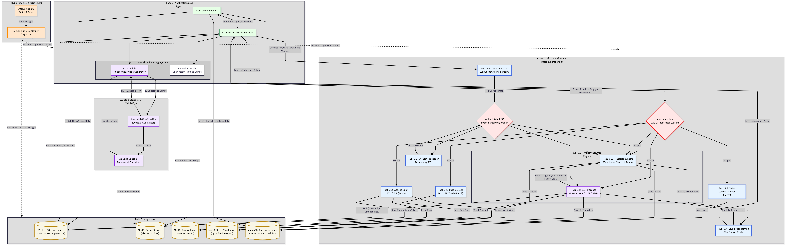

# Agentic Platform for Search Analyze Data (Development version)

***

## About the Project

**Agentic Platform for Search and Analyze Data** is a highly scalable, hybrid data orchestration platform designed to seamlessly integrate data ingestion, distributed processing, traditional algorithmic logic, and AI-driven inference. 

By bridging the gap between scheduled batch processing (via Apache Airflow and Spark) and low-latency event-driven streaming (via RabbitMQ), this platform empowers users and Autonomous AI Agents to build complex, cross-triggered workflows. The system collects, cleans, and analyzes disparate data sources to generate actionable intelligence, predictive insights, and real-time visualizations.

While initially conceptualized for financial analysis, the platform's modular tool-calling architecture makes it highly adaptable to virtually any data-heavy domain. 

### Core Capabilities & Potential Use Cases:

* **📈 Quantitative Finance & Market Intelligence (Original Scope):**
    * Continuously monitor stock/crypto prices via WebSockets to detect anomalies using traditional technical indicators (RSI, MACD).
    * Automatically trigger LLMs to scrape and read the latest financial news or quarterly reports (via RAG) to assess market sentiment when a price breakout occurs.
* **🛒 E-Commerce & Market Research:**
    * Scrape competitor pricing and product availability on a scheduled batch pipeline.
    * Stream real-time customer reviews from social platforms and use AI to perform sentiment analysis, instantly alerting the marketing team to emerging PR crises or viral trends.
* **🛡️ Cybersecurity & IT Operations:**
    * Ingest server logs and network traffic in real-time.
    * Use fast-lane traditional logic to detect DDoS signatures, while utilizing AI classification models in the background to identify sophisticated zero-day anomalies or parse threat intelligence feeds.
* **🏭 IoT & Predictive Maintenance:**
    * Stream sensor data (temperature, vibration) from manufacturing equipment.
    * Apply time-series forecasting models to predict machinery failure before it happens, automatically scheduling maintenance tasks via cross-pipeline API triggers.
* **📱 Social Media & Trend Discovery:**
    * Aggregate vast amounts of unstructured data from forums, Reddit, or Twitter.
    * Utilize Spark for heavy text ETL, embed the data into the Vector Database, and deploy an AI Agent to summarize daily trending topics or consumer behavior shifts into a visual dashboard.

**The ultimate goal of this platform is to act as a unified "brain" where deterministic logic and generative AI work together autonomously to turn raw data into strategic decisions.**

---

## 🤖 Autonomous AI Agent Engine (Now Live!)

The platform now features a fully functional, multi-agent AI engine driven by advanced LLMs (e.g., DeepSeek, Llama 3) via an asynchronous architecture. Users can simply provide a high-level "Goal," and the AI will autonomously design, code, and deploy the entire data pipeline.

### The 3-Step AI Orchestration Lifecycle:

1. **Schedule Architect (Module 1 & 2):**
   * The user defines a broad Scope Goal. The AI translates this into a strategic execution plan, determining the exact schedules (CRON batch workflows) needed to achieve the objective completely.
2. **Tool Researcher & Developer (Module 3):**
   * **RAG Search:** The AI formulates search queries and extracts semantic tags to find existing reusable Tool Scripts in the PostgreSQL `pgvector` database.
   * **Autonomous Coding:** If no suitable tool exists, the AI seamlessly writes a **new Python or Go script** on the fly (incorporating the standard `UDTPDataManager` for seamless MinIO Data Lake integration), defines its JSON schema, and automatically uploads the file to the system.
3. **Task Orchestrator (Module 4):**
   * The AI reviews the approved tools and logically wires them together into a sequential execution graph (A → B → C). It dynamically generates the JSON configuration arguments for each task and binds them to the Apache Airflow DAG.

**Robust Output Parsing:**
To prevent pipeline failures caused by LLM hallucination, the engine utilizes a custom `parse_ai_json_response` utility with advanced AST (Abstract Syntax Tree) fallbacks to auto-repair malformed JSON syntax automatically.

---

## Phase 1: Build Data Pipeline & Infrastructure (Flexible & Scalable)

### 1. Data Lake, Data Warehouse & Storage (Write `docker-compose.yml` )
- MinIO (S3-compatible) - *Data Lake & Script Storage*
    
     Collect all raw data (JSON, CSV from API).
    
    **1. Bucket: `ai-tool-scripts`**
    
    - **Responsibilities:** Store code files (Python, Go, Rust) created by AI or humans.
    - **Internal Structure (Prefix/Folder):**
        - `/traditional-logic/` (Module A)
        - `/ai-inference/` (Module B)
        - `/sandbox-temp/` (For code to be tested)
    
    **2. Bucket: `Raw Data` (also known as Bronze Layer)**
    
    - **Responsibility:** Collect raw data that has just been retrieved from the API (JSON, CSV, HTML) without any modifications, so that we can always revert to the original data if ETL encounters any issues.
    - **Internal Structure (Prefix/Folder):**
        - `/financial-statements/year=2024/quarter=1/`
        - `/stock-prices/ticker=AAPL/`
        - `/news/year=2024/month=10/`
    
    **3. Bucket: `Processed Data` (also known as the Silver/Gold Layer)**
    
    - **Responsibilities:** Collect data that has passed through Task ETL/ELT (Spark Processing) and is already cleaned, then convert it into fast-reading formats such as **Apache Parquet** or **Delta Lake**.
    - **Internal Structure (Prefix/Folder):**
        - `/clean-financials/`
        - `/aggregated-prices/`
    
     Store Tool Scripts (Python, Go, Rust code written by AI or humans)
    
- PostgreSQL - Metadata, State Management & Vector Store
   PostgreSQL serves as the "brain" for managing Users, Scopes, Tools, and the status of AI.
    1. **Group: Vector Database
    Enable Extension:** Enable `pgvector` in PostgreSQL to store High-dimensional Vector data without adding new Database Components
        
        • **`knowledge_embeddings`**: When Task 3.2 (ETL) is executed, Text data (such as economic news, meeting reports) will be processed for Chunking and Embedding generation, stored here for AI Inference (Module B) to perform Retrieval-Augmented Generation (RAG) retrieves relevant context for sentiment analysis or event prediction with high accuracy.
        - `id` (UUID, PK)
        - `scope_id` (FK)
        - `source_reference` (URL or Path of the news file/financial statement in MinIO)
        - `chunk_text` (Text snippet that has been extracted)
        - `embedding` (Vector data type `VECTOR(1536)` or according to the size of the Embedding Model)
        - `created_at` (Timestamp)
        
    2. **Group: User & Authentication**
        
        • **`users`**: Store user information
        - `id` (UUID, PK)
        - `email`, `password_hash`, `full_name`
        - `created_at`, `updated_at`
        
    3. **Group: Scope & Project Management**
        
        • **`scopes`**: Collect details of the scope of work created by the user
        - `id` (UUID, PK)
        - `user_id` (FK -> users.id)
        - `name`, `description`, `goal`
        - `schedule_mode` (Enum: `'MANUAL'`, `'AI_AGENT'` ) (Choose whether to create schedule manually or let AI create it)
        - `status` (Enum: `'ACTIVE'`, `'PAUSED'` )
        
    4. **Group: AI Models & Tool Metadata**
        
        • **`ai_models`**: Model Metadata & Assets
        Store only model data and the location of the Weights file.
        - `id` (UUID, PK)
        - `model_name` (e.g., `'Llama-3-8B-Instruct'`, `'LSTM-Stock-Predictor'` )
        - `version` (e.g., `'v1.0'` )
        - `framework` (e.g., `'PyTorch'`, `'ONNX'`, `'GGUF'` )
        - `model_path` (URL pointing to a `.safetensors` or `.bin` file in MinIO)
        - `model_type` (Enum: `'LLM'`, `'TIME_SERIES'`, `'CLASSIFICATION'`,`'EXTERNAL_API'` )
        
        • **`tools`**: Execution Logic & Scripts
        Store scripts used for operations, including scripts that perform Preprocess -> Load Model -> Postprocess
        - `id` (UUID, PK)
           `ai_model_id` (FK -> ai_models.id, Nullable) *— Insert this FK to indicate which model this script is written to load or manage (if it's a general script that doesn't use AI, set the value to NULL)*
        - `name` (e.g., `'Llama-3 Inference Script'`, `'RSI Calculator'` )
        - `language` (Enum: `'Python'`, `'Go'`, `'C++'` )
        - `script_url` (URL pointing to a `.py` or `.go` script file in MinIO)
        - `input_schema`, `output_schema` (JSON)
        - `author_type` (Enum: `'HUMAN'`, `'AI_GENERATED'` )
        
    5. **Group: Scheduling & Tasks**
        
        • **`schedules`**: Defines the work schedule for each Scope
        - `id` (UUID, PK)
        - `scope_id` (FK)
        - `task_mode` (Enum: `'MANUAL'`,  `'AI_AGENT'` ) (Choose whether to create the task manually or let AI create it)
        - `execution_type`: (Enum: `'CRON'`, `'ONCE'`, `'CONTINUOUS'` ) `CONTINUOUS` is used for Streaming tasks that need to be left running continuously (Can not use right now.)
        - `restart_policy`: (Enum: `'ALWAYS'`, `'ON_FAILURE'`, `'NEVER'` ) For Streaming tasks, if the script crashes, should the system automatically restart? [ `CONTINUOUS` ]
        - `is_sequential` (Boolean: Run consecutively or separately by time)
        - `cron_expression` (For setting independent schedules, specifying run schedule times)
        
        • **`tasks`**: Execution Instances & Configs
        Store instances of tasks to be executed by Airflow or RabbitMQ/Apache Kafka, along with special configurations for each run.
        - `id` (UUID, PK)
        - `schedule_id` (FK)
        - `task_type` (Enum: `'SEARCH'`, `'ETL'`, **`'TRADITIONAL_LOGIC'`**, `'AI_INFERENCE'`, `'VISUALIZE'` )
        - `tool_id` (FK -> tools.id)
        - `engine_type`: (Enum: `'AIRFLOW_DAG'`, `'STREAMING_WORKER'` ) To specify where this Task will be executed.
        - `depends_on_task_id` (Self-referencing FK for tasks that need to be performed sequentially, used to tell Airflow who needs to wait for whom (A $\rightarrow$ B $\rightarrow$ C) to create the correct Workflow) [ `AIRFLOW_DAG` ]
        - `priority` (used for queue jumping, competing for resources when work overloads the server of each Apache Spark scope) [ `AIRFLOW_DAG` ]
        - `execution_order` (used for displaying numbers in order for easy viewing on the UI (1, 2, 3...)) [ `AIRFLOW_DAG` ]
        - `broker_topic`: (String, Nullable) For Streaming tasks, specify the Topic name in the Message Broker (e.g., RabbitMQ) that this script needs to read or write data to [ `STREAMING_WORKER` ]
        - `arguments` (JSONB) *Store Configuration (see example below)*
        
         Example of data collection in the `arguments` column (JSONB)
           Using the `JSONB` data type in PostgreSQL allows you to freely store configurations that have different structures for each task:
        
        **Case 1: Task runs LLM Model (AI Inference)**
        The script in `tools` will pull the model path from `ai_models` and retrieve the generation configuration from `tasks.arguments`
        
        `{
          "temperature": 0.7,
          "max_tokens": 1024,
          "top_p": 0.9,
          "system_prompt": "You are a financial analyst. Your task is to read news and assess sentiment..."
        }`
        
        **Case 2: Task calls an External API (such as OpenAI or a News API)**
        
        `{
          "api_endpoint": "https://api.openai.com/v1/chat/completions",
          "api_key": "sk-proj-xxxxxxxxxxxxxx",
          "retry_attempts": 3
        }`
        
        **Case 3: Calculation Task using Traditional Logic (e.g., stock price alert / RSI)**
        
        `{
          "ticker": "AAPL",
          "timeframe": "1D",
          "rsi_period": 14,
          "overbought_threshold": 70,
          "oversold_threshold": 30
        }`
        
- MongoDB - *NoSQL Data Warehouse
   MongoDB* is responsible for storing data with an unstructured or semi-structured format, or data that is a set of results from AI *.*
    
    **Collection: `processed_data`**
    
     Collect financial data or information that has already been cleaned (ETL) to prepare for sending to the frontend.
    
    **Collection: `ai_insights`**
    
     Collect prediction results and analyses from AI Inference (Module B)
    
    **Collection: `audit_logs`**
    
     Keep a history of script runs in the AI Sandbox for security.

### 2. Data Orchestration & Compute Engine (Core of the Pipeline)

- Apache Airflow (The Orchestrator / DAG Scheduler)
- Apache Spark (The Compute Engine / Distributed Processing)
- Apache Kafka or RabbitMQ (Message Broker & Event Streaming)
- Triggering Mechanism (API Endpoint)
  
---

### 3. (A) Workflow Batch Tasks (Controlled by Airflow)
    
- **Task 3.1: Searching and Collecting Data**
- **Task 3.2: ETL/ELT Task (Spark Processing)**
- **Task 3.3: Hybrid Analytics & Prediction Task** - Module A: Traditional Logic & Calculation (Ordinary Code)
  - Module B: AI & Machine Learning Inference
- **Task 3.4: Data Visualizations/Summarize**

---

### 3. (B) Workflow Streaming Tasks (Event-Driven Pipeline) (Controlled by RabbitMQ or Apache Kafka) (Can not use right now.)
    
- **Task 3.1: Continuous Data Ingestion (WebSocket & Stream)**
- **Task 3.2: Real-time Stream Processing (In-memory ETL)**
- **Task 3.3: Event-Driven Analytics & Prediction Task** - **Module A: Traditional Logic (Fast Lane)**
  - **Module B: AI & Machine Learning Inference (Advanced Track)**
- **Task 3.4: Live Broadcasting & State Update**

---

### 3. (C) Workflow Mix Tasks (Hybrid Event-Triggered Pipeline)
    
**Concept:** A hybrid (Mix) approach that breaks the limitations of traditional pipelines by allowing each Scope to operate independently and assemble Tasks as needed. This system employs a **Cross-Pipeline Triggering** mechanism **via API** to enable streaming speed to work seamlessly with the depth of analysis provided by batch LLM processing.

---

### 4. CI/CD & AI Sandboxing (Security and Automation)
    
**GitHub Actions:** When code is pushed (PySpark, Airflow DAGs), it will automatically build a Docker Image and push it to the Registry.

**1. Pipeline Validate AI Tool Script**
**Static Code Analysis & Security Check (Pre-execution)**
   
**2. Pipeline AI Code Sandbox**
When AI generates a new Tool Script (AI Schedule), the code will first be run in an isolated Docker container to test its functionality and ensure it does not damage the system.

---

### 5.  Kubernetes & Cloud Deployment
    
Use **Minikube** to run K8s locally.

### Phase 2: Build AI Agent Application (Frontend & Backend)

- 1. Front End (User Interface & Dashboard)
- 2. Back End (Core Services & API)
        
        **Manual Schedule:** The user selects an existing Tool Script or uploads code (Python/Go) into the system (save to MinIO).
        
        **AI Schedule (Autonomous Agent):** The user sets a goal (e.g., "Retrieve the financial statements of Company X every quarter"). The AI analyzes the goal and **generates a** new **tool script** or selects an existing one.

### Project Diagrams



---

## Progress

Latest progress summary for the "Agentic Platform for Search Analyze Data":

**Phase 1: Build Data Pipeline & Infrastructure**

1. **Data Lake, Data Warehouse & Storage:**
   * Successfully installed and connected MinIO to serve as the Data Lake for storing Raw Data and Processed Data.
   * Successfully installed and connected PostgreSQL for storing system Metadata and prepared it for High-dimensional Vector storage in the `knowledge_embeddings` table using the `pgvector` extension.
   * Updated the database schema by adding a `ui_position` (JSONB) column to store the X and Y coordinates of the Task Graph and configured `ON DELETE CASCADE` for efficient cascading data deletion.

2. **Data Orchestration & Compute Engine:**
   * Successfully configured Apache Airflow 3 as the Orchestrator for managing workflows and scheduled executions.
   * Successfully created the **Dynamic DAG Factory** (`agentic_dag_factory.py`), enabling Airflow to scan the `schedules.json` file from the Backend to automatically assemble DAGs and bind task dependencies.

3. **(A) Workflow Batch Tasks (End-to-End Pipeline Tested):**
   * **SEARCH Task:** Completed. Tested running a Python script to fetch data, save files to MinIO, and automatically pass the S3 Path to the next task via Airflow XCom.
   * **ETL/ELT Task:** Completed. Created a Custom Operator (`MinIOSparkSubmitOperator`) to instruct Spark to fetch raw data from MinIO (`s3a://`), clean it, write the results back in Parquet/Delta Lake format, and log Metadata into PostgreSQL.
   * **AI_INFERENCE Task:** Completed. Successfully tested running a mock script (.go binary) for AI data analysis, resulting in a perfectly green end-to-end pipeline.

**Phase 2: Build AI Agent Application (Frontend & Backend)**

1. **Back End (Core Services & API - FastAPI):**
   * Established database connections (`init.sql`) and seeded Dummy Users in PostgreSQL.
   * 🚀 **Full CRUD API Router (`scopes_management.py`):** Developed a fully comprehensive API system covering all RESTful operations and background task triggers.
   * 🚀 **AI Engine Module (`main.py` & `llm.py`): IMPLEMENTED.** The backend now houses the fully operational AI agent logic. It asynchronously communicates with DeepSeek/LLMs to plan schedules, search vector databases for tools, generate new code, and automatically inject tasks into the DAG.

2. **Front End (User Interface - React + Vite + Tailwind CSS v4):**
   * Successfully created the Frontend project and containerized it in `docker-compose.yml`.
   * 🚀 **Hierarchical UI & Router:** Completely restructured the web interface into a highly intuitive **Card-based + Pop-up Modal** system.
   * 🚀 **Interactive Task Builder (Flow Graph):** Integrated the `@xyflow/react` library to create an interactive drag-and-drop Pipeline drawing canvas.
   * 🚀 **Dynamic Components & Rendering:** Created components to flexibly render Generative UI graphs (Recharts), tables, or Text Markdown based on AI-analyzed data.
   * 🚀 **AI Polling & Skeletons:** Implemented frontend polling to dynamically render loading skeletons while the AI Engine formulates tasks in the background, updating live once generation is complete.

---

**Next Steps:**
* Connect the actual Event-Trigger system (Streaming Pipeline) to the Backend.
* Enhance the Sandbox validation pipeline for running the AI-generated code securely before saving to MinIO.

---

# 🚀 Comprehensive Guide: Agentic Platform for Search & Analyze Data

## 1. Preparation and Deployment (Infrastructure)

**Deployment Steps:**

1. **Create the Shared Network:** ```bash
docker network create agentic_network

```

2. **Launch Docker Compose:** ```bash
docker-compose -f infrastructure/docker-compose.yml up --build

```

3. **Verify Service Status:** Once the containers are up, you can access the core services at the following local addresses:
* **MinIO (Data Lake):** `http://localhost:9001` (Username: `admin` / Password: `password123`)
* **Apache Airflow (Orchestrator):** `http://localhost:8080` (Username: `admin` / Password: `admin`)
* **RabbitMQ (Message Broker):** `http://localhost:15672`
* **Frontend Web Application:** `http://localhost:5173`

---

## 2. Tool Script Development & Upload Guide

The system executes custom code (Python, Go, C++) across Distributed Worker Nodes. To maximize efficiency and save system resources, it is highly recommended to write **Specific Manual Tool-Calling scripts** tailored for the exact task, rather than implementing heavy, standardized AI Tool protocols.

**Basic Tool Script Requirements:**
Every script deployed to the system (whether Traditional Logic or AI Inference) must accept three core arguments to track data lineage via the Uniform Data Tracking Protocol (UDTP): `--scope_id`, `--schedule_id`, and `--task_id`.

**Uploading Tools to the System:**
You can upload scripts directly through the UI in the **Pipeline Builder**. Click the **"+ Upload New Tool"** button, enter a display name, select the language (Python/Go/C++), and attach your file. The backend will automatically upload it to the `ai-tool-scripts` MinIO bucket and register its metadata in PostgreSQL.

---

## 3. Web Application User Manual

Navigate to `http://localhost:5173` to access the application. The system is divided into three main operational hierarchies:

### 3.1 Scope Management (Project Level)
A "Scope" represents a high-level business objective (e.g., "Real-time Gold Price Monitoring & Sentiment Analysis").
* Navigate to the **Scopes** menu.
* Click **"+ Create New Scope"**.
* Provide a Name, Description, and Goal.
* **Select Schedule Mode:** `MANUAL` or `AI_AGENT`.

### 3.2 Schedule Management (Execution Level)
Inside a Scope, you can create multiple Schedules.
* Click **"+ Add Schedule"**.
* **Select Execution Type:** `CRON`, `CONTINUOUS` (Unavailable right now), or `ONCE`.

### 3.3 Interactive Pipeline Builder (Task Graph)
This is the core workspace where you visually map out data workflows.
* On a Schedule card, click **"⚙️ Manage Tasks"**.
* Click **"+ Add New Task"** in the top right. A new node will appear on the canvas.
* **Drag and Drop:** Position the node wherever you like.
* **Connect Dependencies:** Drag an arrow from one node's handle to another to define the execution order.
* **Configure Tasks:** Double-click any node to open the configuration modal to assign tools and arguments.

### 3.4 AI Insights Dashboard
When a pipeline completes the `VISUALIZE` stage, the generated JSON blocks are automatically rendered into a visually rich dashboard powered by Recharts.